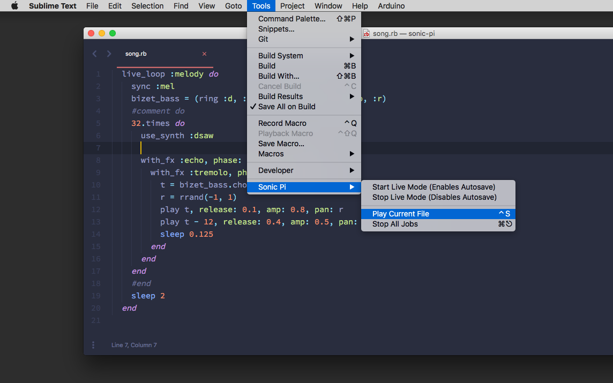

# Sonic Pi Sublime Text 3 Plugin

A simple Sublime Text 3 Plugin that allows writing Sonic Pi Code in Sublime. 



## Features

Under the menu entry `Tools` you are able to select 4 actions in the corresponding `Sonic Pi` submenu:
* **Start Live Mode**: With this mode enabled saving a file in Sublime sends it to the Sonic Pi Server
* **Stop Live Mode**: Disables the mode
* **Play Current File**: Sends the file in the current tab to the Sonic Pi Server
* **Stop All Jobs**: Stops all threads on the Sonic Pi Server. Also triggered by **Stop Live Mode**

Key bindings can be modified in `Default.sublime-keymap`.

## Installation

**Step 1**: Clone the project into your `/Packages/User/` folder of your Sublime Installation. You can locate the folder using the Sublime menu "Preferences → Browse Packages".

```
$ cd "~/Library/Application Support/Sublime Text 3/Packages/User"
$ git clone https://github.com/friedrichweise/sonic-pi-sublime.git
```
**Step 2**: The plugin currently requires the installation of the Python dependency `pythonosc`. Simply download the dependency from <a href="https://github.com/attwad/python-osc/releases">https://github.com/attwad/python-osc/releases</a> and rename it to `pythonosc`. After putting the folder in the `sonic-pi-sublime` plugin folder you are good to go.

## Compatibility

*Feel free to contribute to this table:*

| OS Version | Sublime Text Version | Sonic Pi Version | Tested |
|:-:|:-:|:-:|:-:|
| macOS 10.13 | 3.0 | 3.0.1 | ✅ |


## Bugs
Please use the Github Issues to report any kind of bugs or problems.